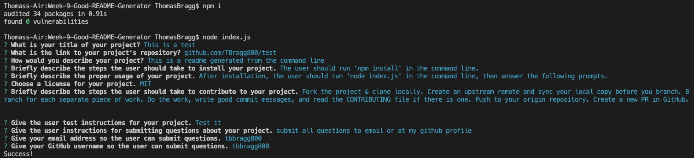

# README Generator

##  Repository: 
https://github.com/TBragg800/Week-9-Good-README-Generator

[]

## Walkthrough Video Demonstration: 
<iframe src="https://drive.google.com/file/d/1Esq8COyBnG4Xt8idbjAS6_3jcxdqecAH/preview" width="640" height="480"></iframe>

## Table of Contents
  [Description](#Description)

  [Installation](#Installation)

  [Usage](#Usage)

  [License](#License)

  [Contributing](#Contributing)

  [Tests](#Tests)

  [Questions](#Questions)
  
## Description
  This project is a CLI application that utilizes node.js to dynamically generate a README.md file to the user through a series of prompts by way of  the Inquirer package. The answers are then appended to the file offering a quick and professional README.

## Installation
  The user should run 'npm install' in the command line.

## Usage
  After installation, the user should run 'node index.js' in the command line, then answer the following prompts.

## License
  MIT

## Contributing
  Fork the project & clone locally. Create an upstream remote and sync your local copy before you branch. Branch for each separate piece of work. Do the work, write good commit messages, and read the CONTRIBUTING file if there is one. Push to your origin repository. Create a new PR in GitHub.

## Tests
  There are no test instructions at this time.

## Questions
  All questions should be submitted to the email listed below. Please consult the GitHub profile or Repo for additional concerns. 
  Email: Ttbbragg83@gmail.com
  Github: [TBragg800] (http://github.com/TBragg800)

## Screenshot of deployed application

